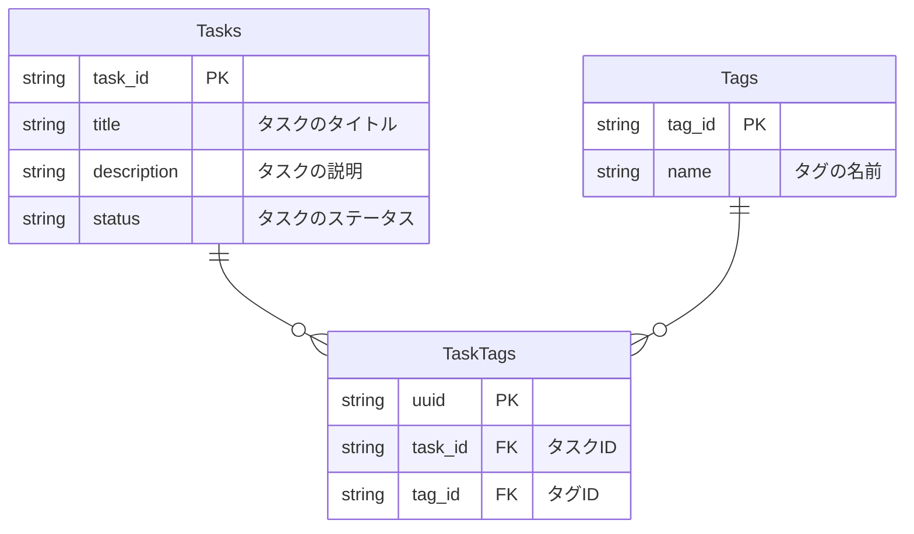

```mermaid
erDiagram
  Tasks ||--o{ TaskTags : ""
  Tags ||--o{ TaskTags : ""

  Tasks {
    string task_id PK
    string title "タスクのタイトル"
    string description "タスクの説明"
    string status "タスクのステータス"
  }

  Tags {
    string tag_id PK
    string name "タグの名前"
  }

  TaskTags {
    string uuid PK
    string task_id FK "タスクID"
    string tag_id FK "タグID"
  }
```
